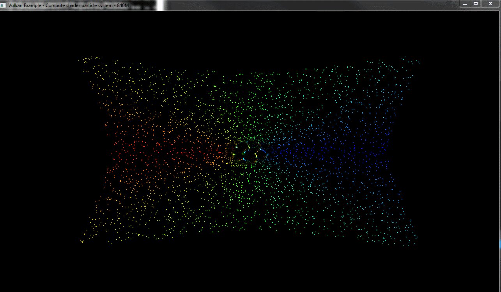

# University of Pennsylvania, CIS 565: GPU Programming and Architecture.
Project 6: Vulkan Flocking: compute and shading in one pipeline!
===============

## User resources
- **Name:** David Grosman.
- **Tested on:** Microsoft Windows 7 Professional, i7-5600U @ 2.6GHz, 256GB, GeForce 840M (Personal laptop).

### Demo Video/GIF

### Project Description
In this project, we were introduced to the workings of a basic Vulkan compute-and-shading application. I implemented a 2D version of the Boids algorithm that I implemented back in Project 1. Covered concepts included setting up basic compute and graphics pipelines, setting up vertex buffers that can be shared between both pipelines, creating commands for each pipeline, and binding information to each pipeline.

### Project Analysis

1. __***Why do you think Vulkan expects explicit descriptors for things like generating pipelines and commands? HINT: this may relate to something in the comments about some components using pre-allocated GPU memory.***__

Since Vulkan is a low-level Graphics API, it expects its users to specify low-level information such as pipeline information (Buffer, image and shader resources binding) and  thus explicit descriptors should also be specified to bound them to command buffer for use by the next draw.

2. __***Describe a situation besides flip-flop buffers in which you may need multiple descriptor sets to fit one descriptor layout.***__

Since a desciptor set correspond to a layout binding in the descriptor set layout, which in turn corresponds with something like `layout(std140, binding = 0)` in `particle.comp`. It is easy to see that a rendering a scene with multiple models (with different vertex/index buffer, normal buffer, etc.) would be another situation in which you would need multiple descriptor sets to fit one descriptor layout.

3. __***What are some problems to keep in mind when using multiple Vulkan queues?***__

The most obvious advantage in using multiple queues is that Commands submitted to different queues may execute in parallel or even out of order with respect to one another. However, this is only advantageous if queues do not need a lot of synchronization between themselves. Since it is the user's responsability to ensure correct work coordination through given primitives such as semaphores, barriers and fences, it makes it harder to use multiple Vulkan queues (in exchange for better performance). 
 * **Take into consideration that different queues may be backed by different hardware**
 Since the queues are backed by different hardware, it means that optimizations for one machine might decrease the performance on another machine (ie.: if a queue is backed by a special hardware which isn't present on all machines running the application these machines might need to back it on the software side which will probably be slower.) 
 * **Take into consideration that the same buffer may be used across multiple queues**
 Race-conditions might occur if writing some output in a buffer used accross multiple queues.
 * **What is one advantage of using compute commands that can share data with a rendering pipeline?**
One of the advantage is to avoid duplicating large data buffers necessary by the compute and graphics queue.

### Blooper

### Credits

* [Vulkan examples and demos](https://github.com/SaschaWillems/Vulkan) by [@SaschaWillems](https://github.com/SaschaWillems)
